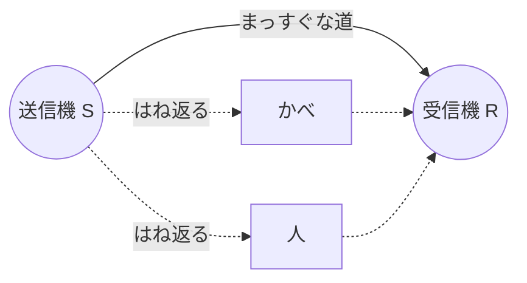

[English](03_reflection_and_paths.md) | 日本語

# 1-3. はね返りと通り道 — Wi-Fi はいくつもの道を同時に通る

電波ははね返ります。だから部屋の中では、送信機からの電波は、まっすぐな道だけでなく、
折れ曲がったたくさんの道も通って受信機に届きます。このページでは、人に当たって
はね返る道の長さを計算します。

> 💡 **このページのコードを動かすには**: ラボを起動して（`./start.sh` か `start.bat` を
> ダブルクリック、または `uv run lab.py`）、[`notebooks/01_waves.ipynb`](notebooks/01_waves.ipynb) を開きます。
> ターミナルがはじめての人 → [ターミナルと uv](../start_here/02_terminal_and_uv.ja.md)

## 1 つの部屋に、たくさんの道

[1-1](01_radio_waves.ja.md) で、電波はものに当たるとはね返ることを知りました。
かべ、床、机、金属の棚、そして **人** も、Wi-Fi の電波をはね返します。



道ごとに長さがちがいます。道が長いと、電波は少しおくれて届き、上下のちょうどちがう
ところで届きます。これがなぜ大事なのかは、次のページでわかります。

## 人に当たってはね返る道を測ろう

上から見た地図を使います。単位はメートルです。このラボのシミュレーターと同じ部屋です。

- 送信機 **S** は $(0, 0)$
- 受信機 **R** は $(3, 0)$。3 m はなれています
- 人 **P** はまん中の $(1.5, y)$ に立ちます。$y$ は、まっすぐな線からどれだけはなれているか

```text
        y
        ^        P (1.5, y)
        |        o
        |      /   \
        |    /       \
   S  --+--------------+-----> x
  (0,0)       1.5      R (3,0)
```

S → P → R の道は、ななめの線 2 本です。1 本 1 本は、たて $y$・よこ $1.5$ の直角三角形の
いちばん長い辺なので、**ピタゴラスの定理（三平方の定理）** で求められます。

$$
\text{S} \to \text{P} = \sqrt{1.5^2 + y^2}, \qquad
\text{道の長さ} = 2\sqrt{1.5^2 + y^2}
$$

## ためそう: Python で道の長さを計算する

`np.hypot(a, b)` は $\sqrt{a^2 + b^2}$ を計算してくれます。

```python
import numpy as np

for y in [0.0, 0.5, 1.0, 1.5, 2.0]:              # 線からのきょり（m）
    path_m = 2 * np.hypot(1.5, y)                  # S -> P -> R
    print(f"y = {y} m: 道 = {path_m:.4f} m, まっすぐより {path_m - 3:.4f} m 長い")
```

結果（計算した値）:

| 人のいる $y$ | S → P → R の道 | まっすぐな 3 m より長い分 |
|---|---|---|
| 0 m（線の上） | 3.0000 m | 0 m |
| 0.5 m | 3.1623 m | 0.1623 m |
| 1.0 m | 3.6056 m | 0.6056 m |
| 1.5 m | 4.2426 m | 1.2426 m |
| 2.0 m | 5.0000 m | 2.0000 m |

この差を、波長の約 12.5 cm（0.125 m）とくらべてみましょう。少し動くだけでも、
道の長さは波長のかなりの部分だけ変わります。

人がちょうど線の上（$y = 0$）に立つと、体がまっすぐな道の一部を **さえぎり** ます。
シミュレーターはこれもまねしています。

> 🤖 **AI に聞いてみよう**
> - 「S → P → R の道に、ピタゴラスの定理を使えるのはなぜ？ 三角形を文字で絵にして」
> - 「人が y = 1 m に立っていて、線から 10 cm はなれる方向に 1 歩動いたら、道はどれだけ長くなる？ 自分で計算できるように手伝って」
> - 「金属の冷蔵庫、木のドア、紙のふすま。Wi-Fi をよくはね返すのはどれ？ 先にわたしに予想させて」

## たしかめよう

1. 電波がいくつもの道を通って受信機に届くのはなぜ？
2. 人が $(1.5, 2)$ に立っています。S → P → R の道の長さは？
3. はね返る道が、まっすぐな道と同じ長さになるのは、人がどこに立つとき？

<details><summary>こたえ</summary>

1. かべや家具や人に当たって、はね返るから。
2. $2\sqrt{1.5^2 + 2^2} = 2 \times 2.5 = 5$ m。
3. S と R を結ぶまっすぐな線の上（$y = 0$）。

</details>

## 📐 このページの数学をもっと知りたい人へ

> リンク先は、大人向けの数学教材 **learning-math**（日本語）です。中学生以上の人や、
> おうちの人といっしょに読んでみてください。

- ピタゴラスの定理（道のりの長さ）: [ピタゴラスの定理](https://github.com/nobufumi-tego/learning-math/blob/main/start_here/02_pythagoras.md)

---

## 📍 ナビゲーション

| ← 前 | 🏠 章 TOP | 📚 全体 TOP | 次 → |
|---|---|---|---|
| [1-2. 波長と周波数](02_wavelength_and_frequency.ja.md) | [第 1 章](README.ja.md) | [ホーム](../README.ja.md) | [1-4. 波の足し算](04_interference.ja.md) |
