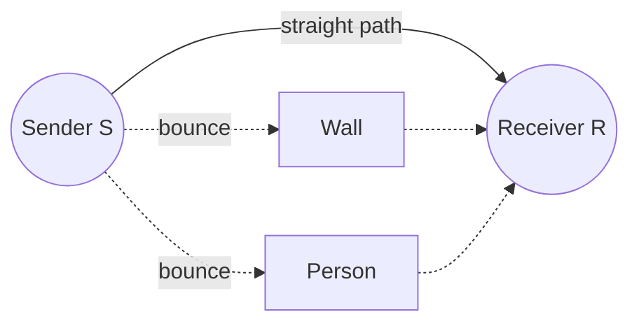

English | [日本語](03_reflection_and_paths.ja.md)

# 1-3. Reflection and paths — Wi-Fi takes many roads at once

Radio waves bounce. So in a room, the wave from the sender reaches the receiver not only
along a straight line, but also along many bent paths. On this page you will measure how
long the path that bounces off a person is.

> 💡 **Run the code on this page**: start the lab (`./start.sh` or double-click
> `start.bat`, or `uv run lab.py`) and open [`notebooks/01_waves.ipynb`](notebooks/01_waves.ipynb).
> New to the terminal? → [Terminal and uv](../start_here/02_terminal_and_uv.md)

## Many paths in one room

On [1-1](01_radio_waves.md) you learned that waves can bounce off things. Walls, the
floor, a table, a metal shelf, and **people** all bounce Wi-Fi waves.



Each path has a different length. A longer path means the wave arrives a little later
and at a different point in its up-and-down. On the next page you will see why that
matters so much.

## Measure the path that bounces off a person

Let's use a map, seen from above, in meters. This is the same room the lab's simulator
uses:

- the sender **S** is at $(0, 0)$,
- the receiver **R** is at $(3, 0)$ — 3 m away,
- a person **P** stands halfway, at $(1.5, y)$. $y$ is how far they are from the
  straight line.

```text
        y
        ^        P (1.5, y)
        |        o
        |      /   \
        |    /       \
   S  --+--------------+-----> x
  (0,0)       1.5      R (3,0)
```

The path S → P → R is two slanted lines. Each one is the long side of a right triangle
with sides $1.5$ and $y$, so by the **Pythagorean theorem**:

$$
\text{S} \to \text{P} = \sqrt{1.5^2 + y^2}, \qquad
\text{path length} = 2\sqrt{1.5^2 + y^2}
$$

## Try it: compute path lengths in Python

`np.hypot(a, b)` computes $\sqrt{a^2 + b^2}$ for you.

```python
import numpy as np

for y in [0.0, 0.5, 1.0, 1.5, 2.0]:              # distance from the line, in m
    path_m = 2 * np.hypot(1.5, y)                  # S -> P -> R
    print(f"y = {y} m: path = {path_m:.4f} m, {path_m - 3:.4f} m longer than straight")
```

Results (computed):

| Person at $y$ | Path S → P → R | Longer than the straight 3 m by |
|---|---|---|
| 0 m (on the line) | 3.0000 m | 0 m |
| 0.5 m | 3.1623 m | 0.1623 m |
| 1.0 m | 3.6056 m | 0.6056 m |
| 1.5 m | 4.2426 m | 1.2426 m |
| 2.0 m | 5.0000 m | 2.0000 m |

Compare these differences with the wavelength, about 12.5 cm (0.125 m). Even a small
step changes the path by a noticeable part of a wavelength.

When the person stands exactly on the line ($y = 0$), their body also **blocks** part of
the straight path. The simulator includes this too.

> 🤖 **Ask your AI**
> - "Why can I use the Pythagorean theorem for the path S → P → R? Draw the triangle
>   with text characters."
> - "If a person stands at y = 1 m and takes one step of 10 cm away from the line, how
>   much longer does the path get? Help me compute it myself."
> - "Which things in a room reflect Wi-Fi strongly: a metal fridge, a wooden door, or a
>   paper wall? Let me guess first."

## Check yourself

1. Why does the wave reach the receiver along many paths?
2. A person stands at $(1.5, 2)$. How long is the path S → P → R?
3. Where must the person stand so the bounced path is the same length as the straight
   one?

<details><summary>Answers</summary>

1. Because it bounces off walls, furniture and people.
2. $2\sqrt{1.5^2 + 2^2} = 2 \times 2.5 = 5$ m.
3. On the straight line between S and R ($y = 0$).

</details>

## 📐 Math behind this page

> These links go to **learning-math**, a separate math course written in Japanese for
> adults. Read them when you are older, or together with a grown-up.

- Pythagorean theorem (length of a path): [ピタゴラスの定理](https://github.com/nobufumi-tego/learning-math/blob/main/start_here/02_pythagoras.md)

---

## 📍 Navigation

| ← Prev | 🏠 Chapter | 📚 Home | Next → |
|---|---|---|---|
| [1-2. Wavelength and frequency](02_wavelength_and_frequency.md) | [Chapter 1](README.md) | [Home](../README.md) | [1-4. Adding waves](04_interference.md) |
