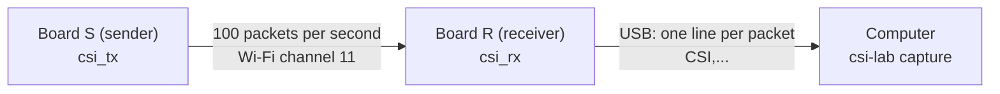

English | [日本語](01_parts.ja.md)

# 3-1. Parts — what you need and how the boards talk

On this page you get everything ready: two ESP32 boards, cables, and an idea of what
each board will do.

> 👪 Do this with a grown-up. Read [0-4. Safety](../start_here/04_safety.md) first.

## What you need

| Item | How many | Notes |
|---|---|---|
| ESP32 development board (ESP32-WROOM-32 family module) | 2 | In Japan, the metal cover of the module must show the **技適 mark** (see below). |
| USB cable that can carry **data** | 2 | Some cables can only charge. If the computer does not see the board, try another cable. |
| Computer (Windows, macOS, or Linux) | 1 | With this lab set up (`uv sync`, see [0-2. Terminal and uv](../start_here/02_terminal_and_uv.md)) |
| Masking tape and a pen | | To label the boards **S** and **R** |
| USB power bank (optional) | 1 | To power the sender away from the computer |

The boards run on **USB power only**. You do not need batteries, soldering, or a Wi-Fi
router.

## The 技適 (Giteki) mark

In Japan, a device that sends radio waves must be certified under the **Radio Act**.
Certified modules carry the **技適 mark** and a number on the metal cover.

- Choose boards whose module shows the mark. Boards bought abroad may not have it.
- Do **not** change the antenna or make the transmitter stronger. The firmware in this
  lab does not do that.

More in [0-4. Safety](../start_here/04_safety.md).

## How the two boards talk

- **S** sends a tiny packet 100 times per second with **ESP-NOW**, a way for ESP32
  boards to talk directly to each other. No router and no password are needed.
- **R** listens on the same channel. For every packet from S it measures the CSI
  (56 amplitudes, one per subcarrier) and sends one line of text to the computer.
- Both boards use **Wi-Fi channel 11**. R ignores packets from other Wi-Fi devices.

**Why build a sender?** The ESP32 can only measure CSI on packets it actually receives.
With our own sender, packets arrive steadily at a known speed.

> 🤖 **Ask your AI**
> - "What is ESP-NOW? Explain it like walkie-talkies, then ask me one question to check."
> - "Why does Japan need a 技適 mark on radio devices? Keep it short."

## Check yourself

1. Why do we build our own sender instead of using the home router?
2. What does board R send to the computer?
3. What should you look for on the module before you buy a board in Japan?

Answers

1. The ESP32 only measures CSI on packets it receives. Our sender gives steady packets
   (100 per second) on a fixed channel.
2. One line of text per packet, starting with `CSI,`, with the time, the signal strength,
   and 56 amplitudes.
3. The 技適 mark on the module's metal cover.

---

## 📍 Navigation

| ← Prev | 🏠 Chapter | 📚 Home | Next → |
|---|---|---|---|
| [Chapter 3](README.md) | [Chapter 3](README.md) | [Home](../README.md) | [3-2. Upload the firmware](02_flash_firmware.md) |
