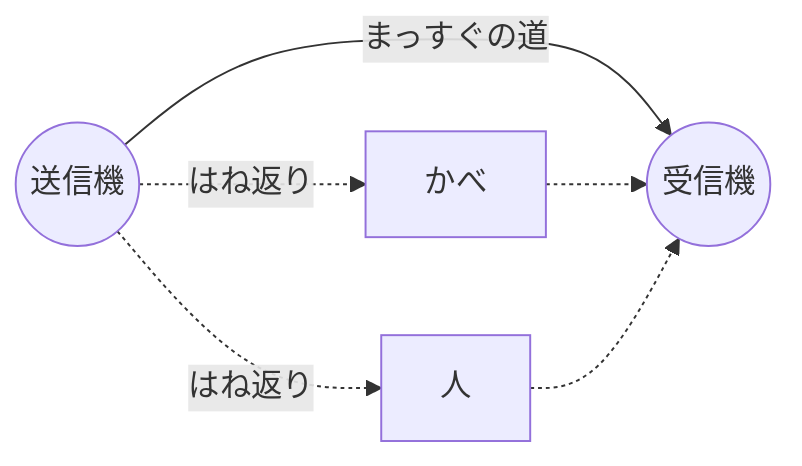

[English](README.md) | 日本語

# レベル 1: 電波ってなに？

**めあて:** 電波とは何かを知り、同じ Wi-Fi の電波が、場所によって強く届いたり弱く届いたりする
わけを理解します。

**時間:** 45 分くらい

**用意するもの:** 「なぜ？」と思う気持ちだけで大丈夫です。Python の部分はやらなくてもかまいません。
やってみたい人は、先に[はじめの説明](../../README.ja.md)を見て準備をしておきましょう。

---

## 1. 知っている「波」

静かな池に小石を落とすと、落ちたところから輪が広がります。このとき、水そのものが池の向こうまで
流れていくわけではありません。水はその場で上がったり下がったりしているだけです。伝わっているのは
**形**、つまり「波」です。

音は、空気を伝わる波です。光も波です。**電波**は光と同じなかまの波ですが、目には見えません。
Wi-Fi も Bluetooth も、テレビもスマホも電波を使っています。

電波は**光の速さ**で進みます。1 秒間に約 30 万 km。地球を 1 秒で約 7 周半できる速さです。

## 2. 周波数と波長

波は、2 つの数で表せます。

- **周波数**: 1 秒間に何回ゆれるか。単位はヘルツ（Hz）です。
  Wi-Fi でよく使う **2.4 GHz（ギガヘルツ）** は、1 秒間に約 24 億回ゆれるという意味です
- **波長**: 波の山から、となりの山までの長さ

```
    山         山         山
   /\         /\         /\
  /  \       /  \       /  \
 /    \     /    \     /    \
       \   /      \   /
        \_/        \_/
   |<-------->|
      波長
```

この 2 つは、かんたんな式でつながっています。

> 波長 ＝ 速さ ÷ 周波数

2.4 GHz の Wi-Fi なら、300,000,000 m/秒 ÷ 2,400,000,000 回/秒 ＝ **0.125 m、つまり約 12.5 cm**。
だいたい手のひらくらいの長さです。この数は、あとで大事になるので覚えておきましょう。

### やってみよう（できる人だけ）: Python で計算する

```bash
uv run python -c "print(299_792_458 / 2.4e9, 'm')"
```

`0.1249 m` くらいと出れば正解です。`5.0e9`（5 GHz の Wi-Fi）でも試してみましょう。
波長は長くなりますか？ 短くなりますか？

## 3. 電波ははね返る

電波がかべや机や人に当たると、一部は**はね返り**（反射）、一部は通りぬけ、一部はすいこまれます。
金属は電波をとてもよくはね返します。人の体はほとんどが水でできていて、水は電波をすいこんだり、
はね返したりします。

だから部屋の中では、送信機からの電波は、まっすぐの道だけで受信機に届くわけではありません。
はね返った、たくさんの回り道からも届きます。



道ごとに長さがちがうので、波は少しずつずれて届きます。

## 4. 波はたし算される: 強め合いと弱め合い

もう一度、池で考えましょう。今度は小石を **2 つ** 同時に落とします。山と山が重なったところは、
水が高く盛り上がります。波が**強め合う**のです。山と谷が重なったところは、平らになります。
波が**弱め合う**のです。これを**干渉**といいます。

受信機でも、すべての道の波が同じようにたし算されます。

- 2 つの道の長さのちがいが 1 波長分（12.5 cm、25 cm…）なら、山と山がそろうので強め合う
- ちがいが半分の波長（約 6 cm）なら、山と谷が重なるので弱め合う

### やってみよう（できる人だけ）: Python で 2 つの波をたす

次の内容を `two_waves.py` という名前で保存して、`uv run python two_waves.py` で動かします。

```python
import numpy as np
import matplotlib.pyplot as plt

x = np.linspace(0, 3, 600)          # 位置（波長の何個分か）
wave_a = np.sin(2 * np.pi * x)       # まっすぐの道
shift = 0.5                          # 道の長さのちがい（波長の何個分か）
wave_b = np.sin(2 * np.pi * (x - shift))  # はね返った道

plt.plot(x, wave_a, label="path A")
plt.plot(x, wave_b, label="path B")
plt.plot(x, wave_a + wave_b, label="A + B", linewidth=3)
plt.legend()
plt.xlabel("position (wavelengths)")
plt.show()
```

`shift` を `0`、`0.25`、`0.5`、`1.0` に変えてみましょう。太い線（A + B）がいちばん大きくなるのは
どれですか？ ほとんど消えてしまうのはどれですか？

## 5. 人が動くと、電波が変わるわけ

部屋の中を人が歩いているところを想像してください。人ではね返る道は、人が動くたびに長くなったり
短くなったりします。ほんの数 cm 動くだけで、その道の波が「強め合う」か「弱め合う」かが変わります。
だから、人が動いている間、受信機に届く電波は**大きくなったり小さくなったり**します。

だれも動かなければ、道はどれも変わらないので、電波はほとんど一定のままです。

**これが Wi-Fi センシングの考え方のすべてです。** 電波のゆれ方を見れば、カメラがなくても
「何かが動いた」ことが分かるのです。

次のレッスンでは、Wi-Fi が波を 1 本だけ送っているのではないことを知ります。たくさんの波を
横にならべて送っていて、1 本 1 本がそれぞれちがうゆれ方をするのです。

---

> **AI に聞いてみよう**
>
> - 「干渉を、水の波を使って小学5年生にも分かるように説明して。そのあと、わたしが分かったか
>   確かめる問題を1つ出して」
> - 「かべの向こうは見えないのに、となりの部屋でも Wi-Fi が使えるのはなぜ？」
> - 「波長が 12.5 cm のとき、道の長さがどれだけ変わると『強め合う』から『弱め合う』に変わる？
>   計算のしかたを一歩ずつ教えて」

## たしかめよう

1. 2.4 GHz の Wi-Fi の波長は、だいたい何 cm ですか？
2. 2 つの道の長さが半分の波長だけちがいます。強め合いますか？ 弱め合いますか？
3. 人が部屋の中を歩くと、受信機の電波がゆれるのはなぜですか？

<details>
<summary>答え</summary>

1. 約 12.5 cm（光の速さ ÷ 2.4 GHz）
2. 弱め合う。一方の山と、もう一方の谷が重なるから
3. 人ではね返る道の長さが、人が動くたびに変わる。そのため、ほかの道の波と強め合ったり
   弱め合ったりが入れかわるから

</details>

---

**次へ:** [レベル 2: CSI を見てみよう](../2-csi-basics/README.ja.md)
