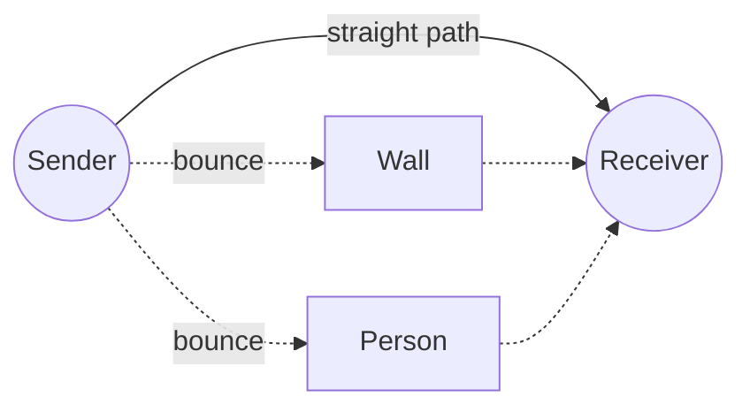

English | [日本語](README.ja.md)

# Level 1: Waves — how radio travels

**Goal:** Understand what a radio wave is and why the same Wi-Fi signal can arrive
strong in one place and weak in another.

**Time:** about 45 minutes

**What you need:** Just curiosity. The Python part is optional. If you want to try it,
set up the repository first (see the main [README](../../README.md)).

---

## 1. Waves you already know

Drop a small stone into a still pond. Rings spread out from where it landed. The water
does not travel across the pond; each spot just goes up and down. What travels is the
**shape**, the wave.

Sound is a wave in the air. Light is a wave too. **Radio waves** are the same kind of
wave as light, but our eyes cannot see them. Wi-Fi, Bluetooth, TV, and phones all use
radio waves.

Radio waves travel at the **speed of light**: about 300,000 km per second. That is fast
enough to go around the Earth about 7 times in one second.

## 2. Frequency and wavelength

Two numbers describe a wave:

- **Frequency**: how many times it wiggles per second. The unit is hertz (Hz).
  Wi-Fi often uses **2.4 GHz**, which means about 2,400,000,000 wiggles per second.
- **Wavelength**: the distance from one top of the wave to the next top.

```
   top        top        top
   /\         /\         /\
  /  \       /  \       /  \
 /    \     /    \     /    \
       \   /      \   /
        \_/        \_/
   |<-------->|
    wavelength
```

They are connected by a simple rule:

> wavelength = speed ÷ frequency

For Wi-Fi at 2.4 GHz: 300,000,000 m/s ÷ 2,400,000,000 per second = **0.125 m, about 12.5 cm**.
That is about the length of your hand. Remember this number, because it will
be important later.

### Try it (optional): compute it with Python

```bash
uv run python -c "print(299_792_458 / 2.4e9, 'm')"
```

You should see about `0.1249 m`. Try `5.0e9` (5 GHz Wi-Fi) too. Is the wavelength longer
or shorter?

## 3. Waves bounce

When a radio wave hits a wall, a table, or a person, part of it **bounces off**
(reflection), part of it goes through, and part of it is absorbed. Metal bounces radio
waves very well. People are mostly water, and water both absorbs and bounces them.

So in a room, the wave from the sender does not reach the receiver only along a
straight line. It also comes along many bent paths:



Each path has a different length, so the waves arrive a little out of step with each
other.

## 4. Waves add up: helping and canceling

Back to the pond. Drop **two** stones at once. Where two tops meet, the water rises
extra high: the waves **help** each other. Where a top meets a bottom, they flatten
out: the waves **cancel** each other. This is called **interference**.

At the receiver, all the paths add up in the same way.

- If two paths differ in length by a whole wavelength (12.5 cm, 25 cm, …), their tops
  line up, so they help.
- If they differ by half a wavelength (about 6 cm), a top meets a bottom, so they cancel.

### Try it (optional): add two waves in Python

Save this as `two_waves.py` and run `uv run python two_waves.py`:

```python
import numpy as np
import matplotlib.pyplot as plt

x = np.linspace(0, 3, 600)          # position, in wavelengths
wave_a = np.sin(2 * np.pi * x)       # the straight path
shift = 0.5                          # extra path length, in wavelengths
wave_b = np.sin(2 * np.pi * (x - shift))  # a bounced path

plt.plot(x, wave_a, label="path A")
plt.plot(x, wave_b, label="path B")
plt.plot(x, wave_a + wave_b, label="A + B", linewidth=3)
plt.legend()
plt.xlabel("position (wavelengths)")
plt.show()
```

Change `shift` to `0`, `0.25`, `0.5`, and `1.0`. When does the thick line (A + B) get
biggest? When does it almost disappear?

## 5. Why a moving person changes the signal

Now imagine a person walking across the room. The path that bounces off the person
gets longer or shorter as they move. Moving just a few centimeters changes whether that
path helps or cancels the others. So the signal at the receiver goes **up and down**
while the person moves.

When nobody moves, all the paths stay the same, and the signal stays almost steady.

**That is the whole idea of Wi-Fi sensing:** watch how the signal wobbles, and you can
tell that something moved, even without a camera.

In the next lesson you will see that Wi-Fi does not send just one wave. It sends many
waves side by side, and each one wobbles in its own way.

---

> **Ask your AI**
>
> - "Explain interference using water waves, for a 5th grader. Then ask me a question to
>   check that I understood."
> - "Why can I use Wi-Fi in the next room, even though I cannot see through the wall?"
> - "If the wavelength is 12.5 cm, how much does a path need to change to go from
>   'helping' to 'canceling'? Show me how to work it out step by step."

## Check yourself

1. What is the wavelength of a 2.4 GHz Wi-Fi wave, roughly?
2. Two paths differ in length by half a wavelength. Do they help or cancel each other?
3. Why does the signal at the receiver wobble when a person walks through the room?

<details>
<summary>Answers</summary>

1. About 12.5 cm (speed of light ÷ 2.4 GHz).
2. They cancel: the top of one meets the bottom of the other.
3. The path bouncing off the person changes length as they move, so it keeps switching
   between helping and canceling the other paths.

</details>

---

**Next:** [Level 2: CSI basics — look at the data](../2-csi-basics/README.md)
