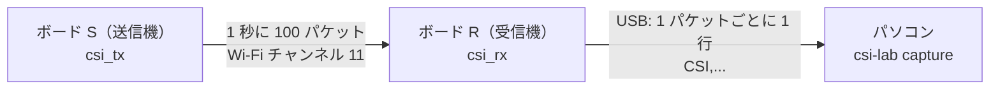

[English](README.md) | 日本語

# レベル 3: 送信機と受信機をつくろう

> **このレッスンは、おうちの人や先生といっしょに行ってください。** 始める前に、
> [安全のガイド](../../guides/safety.ja.md)をいっしょに読みましょう。

**めあて:** ESP32 のボードを 2 台プログラムして、1 台を**送信機**、もう 1 台を**受信機**にします。
そして、自分の部屋の本物の CSI を記録します。

**時間:** 2 時間くらい（はじめてのソフトの準備に、いちばん時間がかかります）

## 用意するもの

| もの | 数 | メモ |
|---|---|---|
| ESP32 開発ボード（ESP32-WROOM-32 のなかまのモジュール） | 2 | 日本では、モジュールの金属のカバーに **技適マーク** があるものを使います。くわしくは安全のガイドを見てください |
| **データも送れる** USB ケーブル | 2 | 充電しかできないケーブルもあります。パソコンがボードを見つけられないときは、別のケーブルを試しましょう |
| パソコン（Windows・macOS・Linux） | 1 | このリポジトリの準備ができているもの |
| マスキングテープとペン | | ボードに「S」と「R」の目印をつけるため |
| モバイルバッテリー（なくてもよい） | 1 | 送信機をパソコンからはなれた場所で動かすため |

ボードは USB の電気だけで動きます。電池も、はんだづけも、Wi-Fi ルーターもいりません。

---

## 1. 2 台のボードの話し方



- **S** は、短いパケットを 1 秒に 100 回送ります。ESP32 どうしが直接話せる **ESP-NOW** という
  方法を使うので、ルーターもパスワードもいりません
- **R** はパケットを受け取るたびに CSI（56 この振幅）を測り、USB でパソコンに 1 行の文字を送ります
- 2 台とも **Wi-Fi のチャンネル 11** を使います

なぜ送信機を作るのでしょう？ ESP32 は、自分が受け取ったパケットの CSI しか測れません。
自分専用の送信機があれば、決まった速さで、とぎれずにパケットが届きます。

## 2. ソフトを入れる

1. Arduino の公式サイトから **Arduino IDE 2** を入れます
2. 左側のボードのマークから **ボードマネージャ** を開き、**esp32** で検索して、
   **「esp32 by Espressif Systems」** を入れます
3. ボードにテープをはって、1 台に **S**、もう 1 台に **R** と書きます

## 3. ボード S（送信機）をプログラムする

1. ボード **S** だけをパソコンにつなぎます
2. Arduino IDE で `firmware/csi_tx/csi_tx.ino` を開きます
3. ボードを選びます: **ツール → ボード → esp32 → ESP32 Dev Module**
4. ポートを選びます: **ツール → ポート**（ボードをつないだときに出てきたもの）
5. **書き込み**（→ の矢印）をクリックします
6. 終わると、青い LED（GPIO2 のピン。ついていないボードもあります）が **1 秒に 1 回**
   点めつします。これが「送っているよ」の合図です

## 4. ボード R（受信機）をプログラムする

1. S をはずして、ボード **R** をつなぎます
2. `firmware/csi_rx/csi_rx.ino` を開き、同じボードと、新しく出てきたポートを選んで、**書き込み**をクリックします
3. もう一度 S に電気を入れます（パソコンかモバイルバッテリーから）。R の LED は、受け取ると点めつします
4. 確かめたい人は、**ツール → シリアルモニタ** を開いて、速さを **921600** にしましょう。
   `CSI,` で始まる行がたくさん出てくれば成功です。**次に進む前に、シリアルモニタは必ず
   閉じてください。** ポートは、一度に 1 つのプログラムしか使えません

## 5. 部屋の準備

- S と R を **3 m くらい**はなし、**同じ高さ**に置きます（たとえば、いす 2 つや、たなの上）。
  2 台を結ぶまっすぐの線の上には、何も置かないようにします
- くらべたい記録は、ぜんぶ**同じ置き方**で記録します
- 部屋にいる人みんなに、何をするのかを伝えて、**先に「いいよ」をもらいましょう**（安全のガイドを見てください）

---

## やってみよう: はじめての本物の記録

R をパソコンにつなぎます。S の電気は、パソコンからでもモバイルバッテリーからでもかまいません。

### ステップ 1: ポートを見つける

```bash
uv run csi-lab ports
```

ボードを 1 台だけつないでいれば、`capture` が自動で見つけてくれます。何台もあるときは、
`--port <名前>` をつけます（たとえば `--port COM3` や `--port /dev/ttyUSB0`）。

### ステップ 2: まず、だれもいない部屋を記録する

部屋から出るか、S と R を結ぶ線から遠いところで、じっと座ってから、次のコマンドを実行します。

```bash
uv run csi-lab capture --label empty --seconds 30
```

ファイルは `data/my-recordings/` に、日付・時刻・ラベルのついた名前で保存されます。
いつも最初に「empty」を記録しましょう。これが**基準**、つまり、ほかのすべてとくらべるための
ものさしになります。

### ステップ 3: 動いているところを記録する

```bash
uv run csi-lab capture --label walk --seconds 30
```

記録している間、S と R を結ぶ線を横切るように、ゆっくり行ったり来たりしましょう。

### ステップ 4: 絵にする

```bash
uv run csi-lab show data/my-recordings/<あなたのファイル>.csv
```

レベル 2 のまねっこの絵とくらべてみましょう。にているところは？ ちがうところは？
本物のデータは、ふつう、もっとざわざわしています。それでふつうです。

## 6. 実験のよい習慣

- **一度に変えるのは 1 つだけ。** 距離と、動く人を同時に変えると、どちらのせいで変わったのか
  分からなくなります
- **くり返す。** 同じ条件で、少なくとも 3 回ずつ記録しましょう
- **実験ノートをつける。** 記録ごとに、日づけと時刻、場所（たとえば「リビング」。住所は
  書きません）、S と R の距離、高さ、部屋にいた人と、その人が「いいよ」と言ってくれたこと、
  何をしたか、いつもとちがうこと（ドアが開いた、ペットが通った など）を書きます

## こまったときは

| こまったこと | 確かめること |
|---|---|
| パソコンがボードを見つけない（ポートが出ない） | 充電専用ではなく、データも送れるケーブルを使っていますか？ ボードによっては USB のドライバー（**CP210x** か **CH340**。USB の差しこみ口の近くにあるチップで決まります）が必要です |
| 書き込みに失敗する（「Failed to connect」） | 書き込みが始まるときに、ボードの **BOOT** ボタンをおしたままにして、「Writing…」と出たらはなします |
| `No CSI data for 5 s` と出る | S に電気が入っていて、LED が点めつしていますか？ 2 台とも、このリポジトリのプログラム（S は `csi_tx`、R は `csi_rx`）を書き込みましたか？ |
| `Cannot open port` と出る | Arduino のシリアルモニタなど、ポートを使っているほかのプログラムを閉じてください |
| 1 秒あたりのパケットが 90 くらいより少ない | ボードを近づけましょう。また、よく使われているほかの Wi-Fi の機器や電子レンジからはなしましょう |

---

> **AI に聞いてみよう**
>
> - 「ESP32 の書き込みが『Failed to connect』で失敗します。エラーの全文はこれです: …
>   何を確かめればいいか、一つずつ順番に教えて」
> - 「ドアを閉めると CSI が変わるか調べたいです。公平な実験の計画をいっしょに考えて。
>   何を同じにして、何を変えればいい？」
> - 「これがわたしの実験ノートです: … 書き忘れている大事なことはある？」

## たしかめよう

1. 家の Wi-Fi ルーターを使うのではなく、自分で送信機を作るのはなぜですか？
2. 最初に「empty」を記録するのはなぜですか？
3. ボードを近づけて、**さらに**窓も開けたら、CSI が変わりました。この実験の何がいけないのでしょう？

<details>
<summary>答え</summary>

1. ESP32 は、自分が受け取ったパケットの CSI しか測れないから。自分の送信機なら、決まった
   チャンネルで、とぎれずに（1 秒に 100 回）パケットが届く
2. 基準になるから。「何も動いていない」とき、**この部屋**ではどう見えるのかが分かって
   いないと、「何かが変わった」とは言えない
3. 2 つのことを同時に変えたので、どちらのせいで変わったのか分からない。変えるのは一度に 1 つだけにする

</details>

---

**前へ:** [レベル 2](../2-csi-basics/README.ja.md) ・ **次へ:** [レベル 4: 動いた？止まってた？](../4-analysis/README.ja.md)
