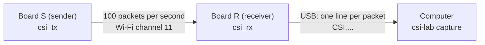

English | [日本語](README.ja.md)

# Level 3: Build your own sender and receiver

> **Do this lesson with a parent, guardian, or teacher.** Read the
> [safety guide](../../guides/safety.md) together before you start.

**Goal:** Program two ESP32 boards, one as a **sender** and one as a **receiver**, and
record real CSI from your own room.

**Time:** about 2 hours (the first time setting up the software takes the longest)

## What you need

| Item | How many | Notes |
|---|---|---|
| ESP32 development board (ESP32-WROOM-32 family module) | 2 | In Japan, the metal cover of the module must show the **技適 mark** (certification for radio devices). See the safety guide. |
| USB cable that can carry **data** | 2 | Some cables can only charge. If the computer does not see the board, try another cable. |
| Computer (Windows, macOS, or Linux) | 1 | With this repository set up |
| Masking tape and a pen | | To label the boards "S" and "R" |
| USB power bank (optional) | 1 | To power the sender away from the computer |

The boards run on USB power only. You do not need batteries, soldering, or a router.

---

## 1. How the two boards talk



- **S** sends a short packet 100 times per second, using **ESP-NOW** (a way for ESP32
  boards to talk directly to each other). No router and no password are needed.
- **R** receives each packet, measures the CSI (56 amplitudes), and sends one line of
  text to the computer over USB.
- Both use **Wi-Fi channel 11**.

Why build a sender? The ESP32 can only measure CSI on packets it actually receives.
Having our own sender means we get steady packets at a known speed.

## 2. Install the software

1. Install **Arduino IDE 2** from the official Arduino website.
2. Open **Boards Manager** (the board icon on the left), search for **esp32**, and install
   **"esp32 by Espressif Systems"**.
3. Put a piece of tape on each board. Write **S** on one and **R** on the other.

## 3. Program board S (the sender)

1. Plug in board **S** only.
2. In Arduino IDE, open `firmware/csi_tx/csi_tx.ino`.
3. Choose the board: **Tools → Board → esp32 → ESP32 Dev Module**.
4. Choose the port: **Tools → Port** (the one that appears when you plug in the board).
5. Click **Upload** (the → arrow).
6. When it finishes, the blue LED (on pin GPIO2, if your board has one) blinks
   **once per second**. That means it is sending.

## 4. Program board R (the receiver)

1. Unplug S. Plug in board **R**.
2. Open `firmware/csi_rx/csi_rx.ino`, choose the same board and the new port, and click **Upload**.
3. Power S again (from the computer or a power bank). R's LED blinks when it receives.
4. Optional check: open **Tools → Serial Monitor** and set the speed to **921600**. You
   should see many lines starting with `CSI,`. **Close the Serial Monitor before the
   next step.** Only one program can use the port at a time.

## 5. Set up the room

- Place S and R about **3 m apart**, at the **same height** (for example, on two chairs
  or shelves), with nothing blocking the straight line between them.
- Keep the setup the **same** for all recordings you want to compare.
- Tell everyone in the room what you are doing and **ask them first** (see the safety guide).

---

## Try it: your first real recordings

Plug R into the computer. S can be powered by the computer or a power bank.

### Step 1: find the port

```bash
uv run csi-lab ports
```

If only one board is connected, `capture` finds it automatically. If there are several,
add `--port <name>` (for example `--port COM3` or `--port /dev/ttyUSB0`).

### Step 2: record an empty room first

Leave the room (or sit still, far from the line between S and R), then run:

```bash
uv run csi-lab capture --label empty --seconds 30
```

The file is saved in `data/my-recordings/` with the date, time, and label in its name.
Always record "empty" first. It is your **baseline**, the thing you compare everything
else with.

### Step 3: record something moving

```bash
uv run csi-lab capture --label walk --seconds 30
```

While it records, walk slowly back and forth across the line between S and R.

### Step 4: draw them

```bash
uv run csi-lab show data/my-recordings/<your-file>.csv
```

Compare your pictures with the pretend ones from Level 2. What is similar? What is
different? Real data is usually noisier. That is normal.

## 6. Good habits for experiments

- **Change one thing at a time.** If you change the distance *and* the person at the same time,
  you cannot tell which one made the difference.
- **Repeat.** Record each condition at least 3 times.
- **Keep a lab notebook.** For each recording write: date and time, place (for example
  "living room," never your address), distance between S and R, height, who was in the
  room and that they agreed, what happened, and anything unusual (a door opened, a pet
  walked by).

## Troubleshooting

| Problem | What to check |
|---|---|
| The computer does not see the board (no port) | Use a data cable, not a charge-only cable. Some boards need a USB driver: **CP210x** or **CH340**, depending on the chip next to the USB connector. |
| Upload fails ("Failed to connect") | Hold the **BOOT** button on the board while the upload starts, and let go when you see "Writing…". |
| `No CSI data for 5 s` | Is S powered on and its LED blinking? Were both boards programmed with this repository's firmware (S = `csi_tx`, R = `csi_rx`)? |
| `Cannot open port` | Close the Arduino Serial Monitor or any other program using the port. |
| Fewer than about 90 packets per second | Move the boards closer, and keep them away from other busy Wi-Fi devices and microwaves. |

---

> **Ask your AI**
>
> - "My ESP32 upload fails with 'Failed to connect'. Here is the full error: … Walk me
>   through what to check, one step at a time."
> - "I want to find out if a closed door changes CSI. Help me plan a fair experiment:
>   what should I keep the same, and what should I change?"
> - "Here is my lab notebook entry: … What important information is missing?"

## Check yourself

1. Why do we build our own sender instead of just using the home router?
2. Why should you record "empty" first?
3. You moved the boards closer *and* opened a window, and the CSI changed. What is the
   problem with this experiment?

<details>
<summary>Answers</summary>

1. The ESP32 can only measure CSI on packets it receives. Our own sender gives steady
   packets (100 per second) on a fixed channel.
2. It is the baseline. You need to know what "nothing moving" looks like in *this* room
   before you can say something changed.
3. Two things changed at once, so you cannot tell which one caused the change. Change
   one thing at a time.

</details>

---

**Previous:** [Level 2](../2-csi-basics/README.md) · **Next:** [Level 4: Analysis — did something move?](../4-analysis/README.md)
